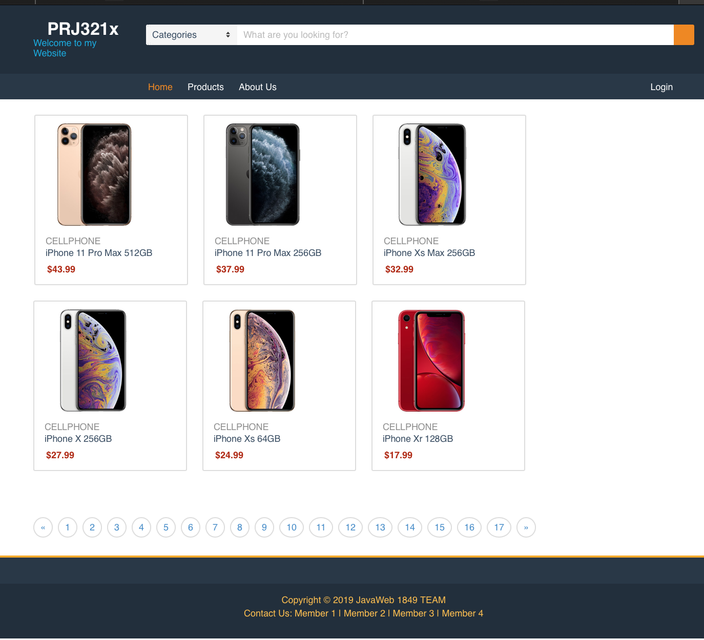
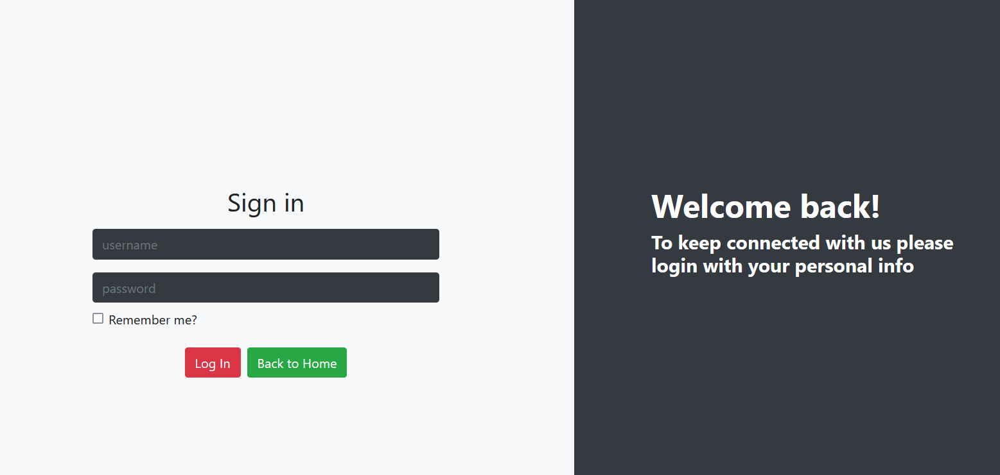
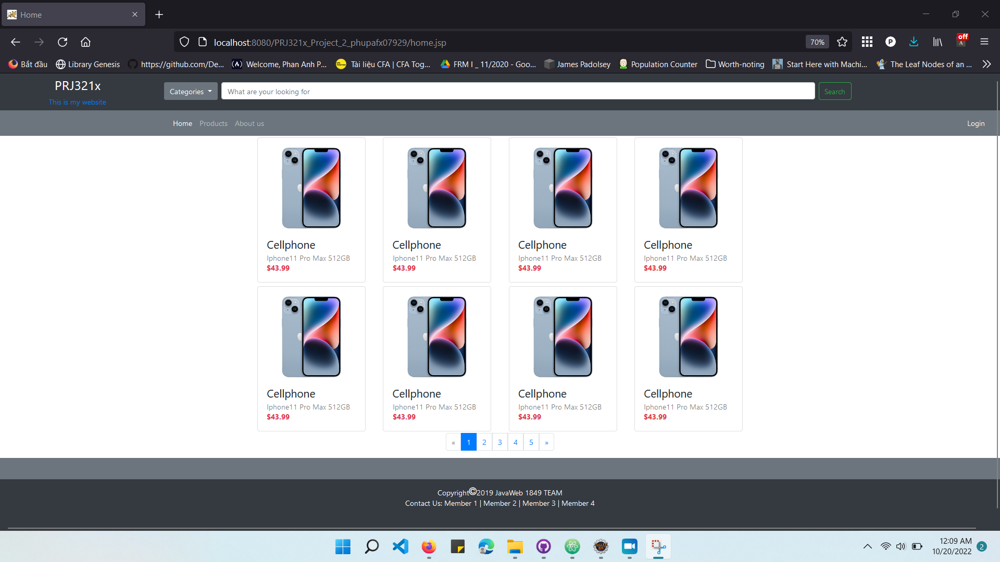
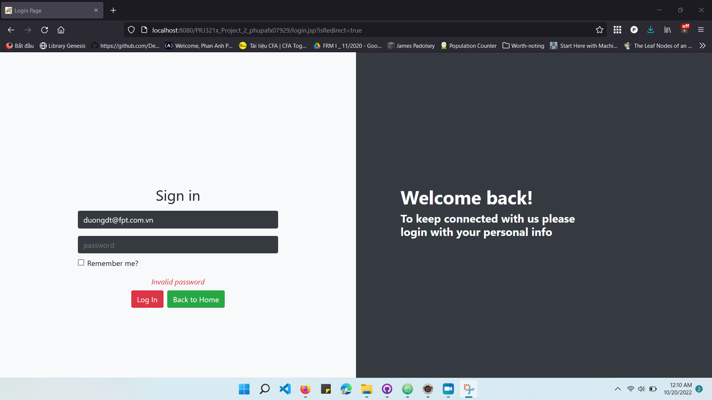
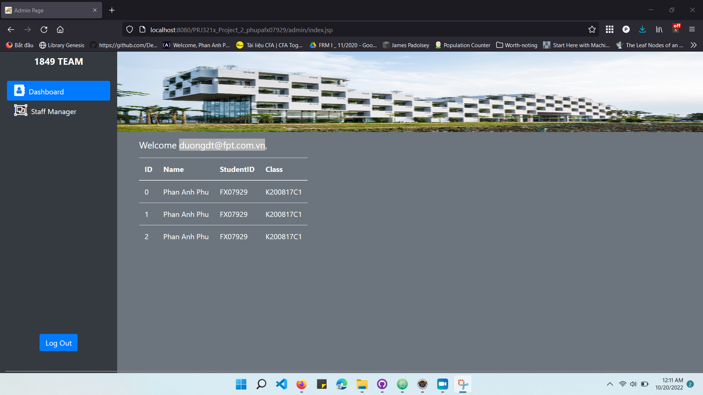

# prj321x_02_vn-java-web-ecommerce-website

 This folder contains my submission to the assignment `E-commerce website (cellphones)` in the course PRJ321x_02-VN (Web application with Java), a part of the path Software Engineering provided by FUNiX.

## About the project
The app is mainly about an e-commerce website for cellphones. To achieve the goal, it is developed with Java, JSP and Servlet, JDBC for MySQL, JSTL as well as other supports from HTLM forms, and Java API in session management.

- **Keyword**: _Java, web, jsp, servlet, web.xml, Java beans, session management, JDBC, MySQL_.

## Functional descriptions

The app is mainly about an e-commerce website for cellphones with some below pages:
- Home Page:
  - Home Page must show all products in database with proper pagination
  - On clicking Login should redirect to Login Page
  - On clicking Register should redirect to Register Page
  - There is a search field and Home Page should display products based on search keyword ("No products found" should be displayed in case of no matching products)
  - On click a product thumbnail, Info Product Page will be showed
- Info Product Page:
  - sdhs
- Login Page:
  - alert appears if wrong email or password. Otherwise, redirect to Admin Page.
  - tick Remember me helps to auto fill email for another login in the same session
- Admin Page:
  - add Log out feature
  - display the name of user logged-in in "Welcome <user>,"
- build carts
- manage session and build login features

|     |     |
| :------------- | :------------- |
| 
Home Page
      |  
Login Page
     |  

|        |
| :------------- |
|   
Admin Page
 |

## Demo

_(to be updated)_

The demo video can be seen via: https://www.youtube.com/watch?v=q5fqIWtCieg

|  
Home Page
 |       |
| :------------- | :------------- |
|   
**Login Page**
      |      |  
| 
**Admin Page**
 |        |  
**Login Page**
 |

## Further enhancement
- Adjust user interface for better interaction
- Use database to store and manage session
