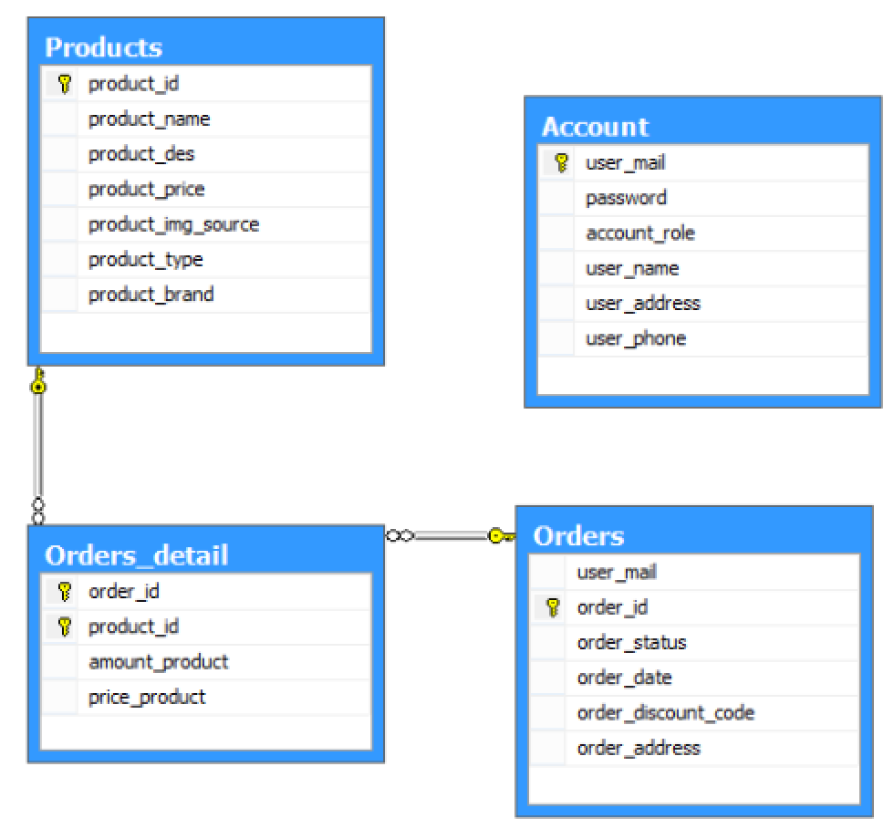

# prj321x_02_vn-java-web-ecommerce-website

 This folder contains my submission to the assignment `E-commerce website (cellphones)` in the course PRJ321x_02-VN (Web application with Java), a part of the path Software Engineering provided by FUNiX.

## About the project
The app is mainly about an e-commerce website for cellphones. To achieve the goal, it is developed with Java, JSP and Servlet, JDBC for MySQL, JSTL as well as other supports from HTLM forms, and Java API in session management.

There is 2 versions of the project: `PRJ321x_Project_3_manualConfig.zip` for manual configuration in xml file and traditional Servlet API; `PRJ321x_Project_3_SpringBoot.zip` using Spring Boot for autoconfiguration and annotation-based development.

- **Keyword**: _Java, web, jsp, servlet, web.xml, Java beans, session management, JDBC, MySQL, Spring, annotation-based controller, JPA_.

## Functional descriptions

The app is mainly about an e-commerce website for cellphones with some below pages:
- **Home **Page****:
  - Home Page must show all products in database with proper pagination
  - On clicking `Login` should redirect to Login Page
  - On clicking `Register` should redirect to Register Page
  - There is a search field and Home Page should display products based on search keyword and `Search` button clicking ("No products found" should be displayed in case of no matching products)
  - On click a product thumbnail, Info Product Page will be showed
- **Info Product** **Page**:
  - Info Product Page must show correct detail info of the corresponding
  - Button `Add to Cart` to add products into carts and redirect to Cart Page
- **Cart** **Page**:
  - Display the details of products which are added into the cart with quantity, price and total amount
  - User can increase or decrease the number of each item in cart; or remove items in cart
  - There are fields to get customer's information
  - On clicking `Submit` button, order must be inserted in database
- **Login** **Page**:
  - alert appears if wrong email or password. Otherwise, redirect to Admin Page.
  - tick `Remember me` helps to auto fill email for another login in the same session
- **Register** **Page**:
  - alert appears if wrong email or password or not matching re-password. Otherwise, redirect to Login Page and new user info must be recorded in database.
- **Admin** **Page**:
  - add `Log out` feature - on click the button Log out, session should be cleaned and redirect to Login Page
  - display the name of user logged-in in "Welcome \<user>,"

|     |     |
| :------------- | :------------- |
| 
Register Page
      |  
Login Page
     |  

|        |     |
| :------------- |:------------- |
|   
Admin Page
 |
Info Product Page
     |

|        |
| :------------- |
|   
Cart Page
 |

|        |
| :------------- |
|   
Home Page
 |

## Demo

_**Updated:**_ The project is rebuilt with Spring Boot using **JPA** for database CRUD and object mapping, **Spring form and validation** (both validation annotation and validator interface) to check user input as well as data binding, **annotation-based** controller  (archived in `PRJ321x_Project_3_SpringBoot.zip`).

The demo video can be seen via: https://www.youtube.com/watch?v=hh8Dcpho_u8

_**NOTES:**_ The database is designed in MySQL as per the model by file `ShoppingDB_MySQL.sql`
    

## Further enhancement
- Adjust user interface for better interaction
- Modify session management by using both cookies and url rewriting
- ~~Convert all Java code in JSP into JSTL + EL~~ → updated in `PRJ321x_Project_3_SpringBoot`
- Add some extra features such as order history, order management
- ~~Use Spring framework to develop the app~~ → Updated with `PRJ321x_Project_3_SpringBoot`, but need to apply Spring Security for log-in and register function
